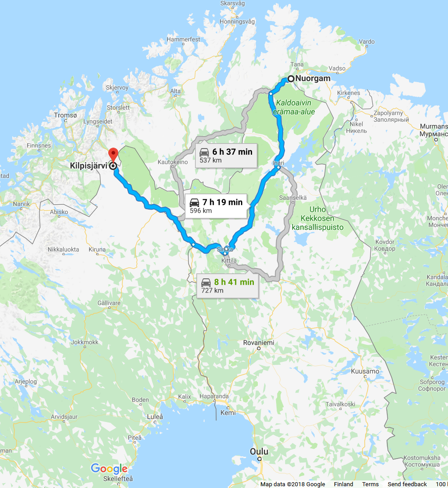

```{r setup, include=FALSE}
knitr::opts_chunk$set(echo = TRUE)
```
\pagebreak

# Examples

# Table 14.1: Birth and Death Rates for Seven Countries

**Source of data:** https://population.un.org/wpp/Download/Standard/Population/

Countries selected manually to be the same ones as in **Chapter 17**.

```{r}
country7 <- read.table("data/country7.txt", sep = '\t', header = TRUE)
country7
```
\pagebreak

## Table 14.2

```{r}
options(digits = 2)
dist7 <- dist(country7)
dist7
```
\pagebreak

## Table 14.4

```{r}
cscal7 <- cmdscale(dist7, k = 2)
cscal7
```
\pagebreak

## Figure 14.1

```{r}
country7 <- cbind(country7, cscal7)
names(country7) <- c("BirthR", "DeathR", "Dim1", "Dim2")
countries <- trimws(rownames(country7))

library(ggplot2)

p1 <- ggplot(country7, aes(x = Dim1, y = Dim2))
p2 <- p1 + geom_point() + geom_text(aes(label = countries), 
                                    position = position_nudge(y = +0.20), size=3)
p3 <- p2 + scale_x_continuous(name = "Dimension 1", limits = c(-3, 3))
p4 <- p3 + scale_y_continuous(name = "Dimension 2", limits = c(-1.25, 1.25))
p5 <- p4 + theme_bw()
p6 <- p5 + theme(panel.grid.major = element_blank(), panel.grid.minor = element_blank())
p7 <- p6 + coord_fixed(ratio = 1)
p7
```
\pagebreak

# Table 14.3: Dissimilarity Data for All Pairs of 10 Colas for 2 Subjects

These data give an example of (symmetric) dissimilarity (proximity) matrices. There are no analyses involved here, but see some of the further examples (like the classical music composers) for possible ways to visualize and analyze these types of data sets.

```
Subject 1:                             Subject 2:
    Cola Number                            Cola Number
    1  2  3  4  5  6  7  8  9 10           1  2  3  4  5  6  7  8  9 10
 1  0                                   1  0
 2 16  0                                2 20  0
 3 81 47  0                             3 75 35  0
 4 56 32 71  0                          4 60 31 80  0
 5 87 68 44 71  0                       5 80 70 37 70  0
 6 60 35 21 98 34  0                    6 55 40 20 89 30  0
 7 84 94 98 57 99 99  0                 7 80 90 90 55 87 88  0
 8 50 87 79 73 19 92 45  0              8 45 80 77 75 25 86 40  0
 9 99 25 53 98 52 17 99 84  0           9 87 35 50 88 60 10 98 83  0
10 16 92 90 83 79 44 24 18 98  0       10 12 90 96 89 75 40 27 14 90  0
```
\pagebreak

# Table 14.5: Road Distances of 15 Selected Places in Finland

```{r}
fitowns <- c("Helsinki", "Joensuu", "Jyväskylä", "Kilpisjärvi", "Kokkola", "Kotka",
             "Kuopio", "Kuusamo", "Lappeenranta", "Nuorgam", "Oulu", "Rovaniemi",
             "Tampere", "Turku", "Vaasa")
ftwns <- abbreviate(fitowns, 3, strict = TRUE)

fidist <- matrix(
  c(   0, 438, 272,1202, 491, 134, 383, 802, 223,1328, 612, 832, 174, 166, 419,
     438,   0, 245, 979, 429, 343, 136, 459, 236,1045, 393, 550, 394, 549, 494,
     272, 245,   0, 931, 241, 244, 144, 551, 219,1056, 339, 561, 151, 304, 282,
    1202, 979, 931,   0, 789,1177, 878, 620,1144, 649, 592, 428,1079,1226, 910,
     491, 429, 241, 789,   0, 488, 315, 411, 460, 916, 196, 419, 324, 436, 121,
     134, 343, 244,1177, 488,   0, 316, 735, 108,1303, 585, 806, 243, 295, 484,
     383, 136, 144, 878, 315, 316,   0, 417, 264,1006, 286, 509, 293, 448, 379,
     802, 459, 551, 620, 411, 735, 417,   0, 682, 617, 212, 191, 702, 848, 533,
     223, 236, 219,1144, 460, 108, 264, 682,   0,1271, 551, 774, 275, 364, 501,
    1328,1045,1056, 649, 916,1303,1006, 617,1271,   0, 719, 495,1207,1353,1035,
     612, 393, 339, 592, 196, 585, 286, 212, 551, 719,   0, 222, 491, 633, 318,
     832, 550, 561, 428, 419, 806, 509, 191, 774, 495, 222,   0, 712, 856, 541,
     174, 394, 151,1079, 324, 243, 293, 702, 275,1207, 491, 712,   0, 153, 244,
     166, 549, 304,1226, 436, 295, 448, 848, 364,1353, 633, 856, 153,   0, 331,
     419, 494, 282, 910, 121, 484, 379, 533, 501,1035, 318, 541, 244, 331,   0
   ), nrow = 15, ncol = 15, byrow = TRUE, 
      dimnames = list(fitowns, ftwns))

fidist
```
\pagebreak

## Table 14.6

```{r}
n <- dim(fidist)[1]

fiscal <- cmdscale(d = fidist, k = n - 1, eig = TRUE, list. = TRUE)
fiscal$eig

as.matrix(format(fiscal$eig, scientific = FALSE, justify = "right", nsmall = 0L, digits = 0))

fiscal$points[, 1:2]
```
\pagebreak

## Figure 14.2

```{r, fig.width=8, fig.height=8}
# draft plot:

y <- fiscal$points[, 1] # exchange x and y to show the map
x <- fiscal$points[, 2] # so that Helsinki is in the South

plot(x, y, type = "n", xlab = "", ylab = "", asp = 1, axes = TRUE)
text(x, y, rownames(fiscal$points), cex = 1.0)

#install.packages("vegan") # by Jari Oksanen, Finland
library(vegan)

finland <- as.data.frame(scores(fiscal$points[, 1:2])) # adds names Dim1, Dim2

library(ggplot2)

p1 <- ggplot(finland, aes(x = Dim2, y = Dim1)) # OBS! rotation
p2 <- p1 + geom_point() + geom_text(aes(label = fitowns), 
                                    position = position_nudge(y = +40), size=4)
p3 <- p2 + scale_x_continuous(name = "Dimension 2", limits = c(-500,  +500))
p4 <- p3 + scale_y_continuous(name = "Dimension 1", limits = c(-500, +1000))
p5 <- p4 + theme_bw()
p6 <- p5 + theme(panel.grid.major = element_blank(), panel.grid.minor = element_blank())
p7 <- p6 + coord_fixed(ratio = 1)
p7
```
\pagebreak

## Figure 14.3

For an interactive map, see https://goo.gl/maps/5Yp6nG31HeQ2

```{r echo=FALSE, out.width='100%'}

```

For an interactive map, see https://goo.gl/maps/5Yp6nG31HeQ2

\pagebreak

# Table 14.7: Proximity Matrix of Ten Remarkable Classical Music Composers Selected and Compared by Olli Mustonen

```{r}
composers <- c("Bach", "Haydn", "Mozart", "Beethoven", "Schubert", "Brahms",
               "Sibelius", "Debussy", "Bartok", "Sostakovits")
OMD <- matrix(
c( 0,  50,  30,  20,  40,  40,  40,  50,  30,  30,
  50,   0,  10,  15,  30,  70,  90,  50,  80,  40,
  30,  10,   0,  20,  25,  40,  70,  50,  80,  50,
  20,  15,  20,   0,  10,  20,  25,  80,  60,  40,
  40,  30,  25,  10,   0,  15,  60,  50,  70,  60,
  40,  70,  40,  20,  15,   0,  20,  70,  70,  70,
  40,  90,  70,  25,  60,  20,   0,  35,  35,  20,
  50,  50,  50,  80,  50,  70,  35,   0,  15,  40,
  30,  80,  80,  60,  70,  70,  35,  15,   0,  20,
  30,  40,  50,  40,  60,  70,  20,  40,  20,   0
 ), nrow = 10, ncol = 10, byrow = TRUE, dimnames = list(composers, composers))

n <- dim(OMD)[1]
OMDS <- cmdscale(d = OMD, k = n-1, eig = TRUE, list. = TRUE)
as.matrix(format(OMDS$eig, scientific = FALSE, justify = "right", nsmall = 0L, digits = 0))
pk1 <- cumsum(abs(OMDS$eig))/sum(abs(OMDS$eig))
pk2 <- cumsum(OMDS$eig^2)/sum(OMDS$eig^2)
pk1
pk2

```
\pagebreak

## Figure 14.4

```{r}
OwMDS <- wcmdscale(d = OMD, k = n-1, eig = TRUE)
plot(OwMDS, cex = 1.0)
Owcscal <- as.data.frame(scores(OwMDS$points[, 1:2]))

library(ggplot2)

p1 <- ggplot(Owcscal, aes(x = Dim1, y = Dim2))
p2 <- p1 + geom_point() + geom_text(aes(label = composers), 
                                    position = position_nudge(y = +4), size=4)
p3 <- p2 + scale_x_continuous(name = "Dimension 1", limits = c(-40, +50))
p4 <- p3 + scale_y_continuous(name = "Dimension 2", limits = c(-50, +40))
p5 <- p4 + theme_bw()
p6 <- p5 + theme(panel.grid.major = element_blank(), panel.grid.minor = element_blank())
p7 <- p6 + coord_fixed(ratio = 1)
p7
```
\pagebreak

## Figure 14.5

```{r}
library(vegan)
OmonoMDS <- monoMDS(dist = OMD, y = cmdscale(OMD, 3), k = 3, 
                    model = "global", scaling = FALSE, pc = FALSE)

x <- OmonoMDS$points[, 1]
y <- OmonoMDS$points[, 2]
plot(x, y, type = "n", asp = 1, axes = TRUE)
text(x, y, composers, cex = 1.0)

Omono <- as.data.frame(scores(OmonoMDS$points[, 1:3])) # adds names MDS1,2,3

p1 <- ggplot(Omono, aes(x = MDS1, y = MDS2))
p2 <- p1 + geom_point() + geom_text(aes(label = composers), 
                                    position = position_nudge(y = +4), size=4)
p3 <- p2 + scale_x_continuous(name = "Dimension 1", limits = c(-40, +50))
p4 <- p3 + scale_y_continuous(name = "Dimension 2", limits = c(-50, +40))
p5 <- p4 + theme_bw()
p6 <- p5 + theme(panel.grid.major = element_blank(), panel.grid.minor = element_blank())
p7 <- p6 + coord_fixed(ratio = 1)
p7
```
\pagebreak

## Figure 14.6

```{r}
p1 <- ggplot(Omono, aes(x = MDS1, y = MDS3))
p2 <- p1 + geom_point() + geom_text(aes(label = composers), 
                                    position = position_nudge(y = +4.1), size=4)
p3 <- p2 + scale_x_continuous(name = "Dimension 1", limits = c(-40, +50))
p4 <- p3 + scale_y_continuous(name = "Dimension 3", limits = c(-50, +40))
p5 <- p4 + theme_bw()
p6 <- p5 + theme(panel.grid.major = element_blank(), panel.grid.minor = element_blank())
p7 <- p6 + coord_fixed(ratio = 1)
p7
```
\pagebreak

## Figure 14.7

```{r}
# instead of Shepard function, use stressplot from vegan package:
strpl <- stressplot(OmonoMDS, pch = 16)
plot(strpl, pch = 16, xlab = "Dissimilarity", ylab = "Distance")
lines(sort(strpl$x), sort(strpl$yf), type = "S")
```
\pagebreak

# Table 14.8: The Influence of Age of Relationship Status with Boyfriends

```{r}
Girls <- as.table(rbind(
          c(21, 21, 14, 13, 8),
          c(8, 9, 6, 8, 2),
          c(2, 3, 4, 10, 10)))

dimnames(Girls) <- list(relship = c("No boyfriend",
                                    "Boyfriend: No sex",
                                    "Boyfriend: Sex"),
                       agegroup = c("< 16", "16-17", "17-18", "18-19", "19-20"))
Girls

# observed and expected frequencies, chi-square test, percentages etc.

Xsq <- chisq.test(Girls)  # Prints test summary
Xsq$observed   # observed counts (same as Girls)
Xsq$expected   # expected counts under the null
Xsq

100*prop.table(Girls, margin = 1)
100*prop.table(Girls, margin = 2)
100*prop.table(Girls)

addmargins(100*prop.table(Girls, margin = 1), margin = c(1,2), FUN = list(Sum = mean, Sum = sum) )

```
\pagebreak

## Figure 14.8

```{r}
#install.packages("ca")
library(ca)
caGirls <- ca(Girls)
caGirls
```
\pagebreak
```{r}
summary(caGirls)

plot(caGirls, lines=c(FALSE, TRUE), mass=c(TRUE,TRUE), xlim = c(-0.4,1))
```
\pagebreak

# Table 14.9: Types of Work Activities and Main Advantages of Job from 6933 Survey Respondents

**Source of data:** Lebart, L., Morineau, A. and Warwick, K. (1984). *Multivariate Descriptive Statistical Analysis: Correspondence Analysis and Related Techniques for Large Matrices.* John Wiley & Sons, Chichester, U.K.

```{r}
jobs <- read.csv(file = "data/jobs.csv", row.names = 1)
str(jobs)
row.names(jobs) <- jobs$WORKTYPE
jobs <- jobs[, 2:23]
# for simplicity, withOUT supplementary variables:
jobs2 <- jobs[, 1:17]
head(jobs2[, c(1:3, 16:17)])
chisq.test(jobs2)
```
\pagebreak

## Figure 14.9

```{r, out.width='100%', fig.width=8, fig.height=8}
lebart <- ca(jobs2)
plot(lebart, xlim = c(-1.1, 1.1), ylim = c(-1.1, 0.5), mass=c(TRUE,TRUE))
```
